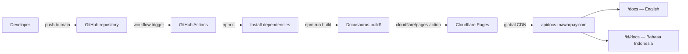

# MawarPay API Documentation

[](https://docusaurus.io/)
[](https://nodejs.org/)
[](https://www.typescriptlang.org/)
[](https://apidocs.mawarpay.com)

This is the official API documentation website for MawarPay, built using [Docusaurus](https://docusaurus.io/), a modern static website generator.

## Features

- 📚 Comprehensive API documentation
- 🌐 Multi-language support (English & Bahasa Indonesia)
- 💻 Interactive code examples with syntax highlighting
- 🔍 Search functionality
- 📱 Responsive design

## Prerequisites

- Node.js >= 22.0
- npm (preferred; lockfile committed)

## Installation

```bash
npm install
```

## Local Development

```bash
npm start
```

or

```bash
yarn start
```

This command starts a local development server and opens up a browser window. Most changes are reflected live without having to restart the server.

The site will be available at `http://localhost:3000`

## Build

```bash
npm run build
```

or

```bash
yarn build
```

This command generates static content into the `build` directory and can be served using any static contents hosting service.

## Docker Build & Run

Build the static site and serve it with Nginx inside Docker:

```bash
docker build -t mawarpay/api-docs .
docker run --rm -p 8080:80 mawarpay/api-docs
```

Then open `http://localhost:8080` to view the docs.

## Serve Production Build

To test the production build locally:

```bash
npm run serve
```

or

```bash
yarn serve
```

## Clear Cache

If you encounter build issues, clear the cache:

```bash
npm run clear
```

or

```bash
yarn clear
```

## Deployment

The site is deployed to `https://apidocs.mawarpay.com`.

### Deployment flow



### Cloudflare Pages (Recommended)

This project deploys as a static site on Cloudflare Pages:

1. **Create a Cloudflare Pages project**
   - In the [Cloudflare dashboard](https://dash.cloudflare.com), open **Workers & Pages → Create → Pages → Connect to Git**, or create an empty project for direct uploads from GitHub Actions.
   - Set the production branch to `main`.

2. **Build settings (for Git-connected projects)**
   - Build command: `npm run build`
   - Build output directory: `build`
   - Node.js version: 22.x

3. **Automatic deployments**
   - Every push to `main` triggers `.github/workflows/cloudflare-pages-deploy.yml`.
   - The workflow builds English output in `build/` and Indonesian output in `build/id/`.

4. **Custom domain**
   - Point `apidocs.mawarpay.com` to the Cloudflare Pages project in **Custom domains**.

#### GitHub Actions → Cloudflare Pages

Continuous deployment is configured via `.github/workflows/cloudflare-pages-deploy.yml`. Add these repository secrets:

| Secret | Description |
|---|---|
| `CLOUDFLARE_API_TOKEN` | API token with **Cloudflare Pages — Edit** permission |
| `CLOUDFLARE_ACCOUNT_ID` | Cloudflare account ID from the dashboard |
| `CLOUDFLARE_PAGES_PROJECT_NAME` | Pages project name (for example `mawarpay-api-docs`) |

Then push to `main`, or run the workflow manually with **Run workflow**.

### Google Cloud Run Deployment

1. **Authenticate & set project**
   ```bash
   gcloud auth login
   gcloud config set project <PROJECT_ID>
   ```
2. **Enable required APIs (one-time)**
   ```bash
   gcloud services enable run.googleapis.com cloudbuild.googleapis.com artifactregistry.googleapis.com
   ```
3. **Create an Artifact Registry repo (one-time)**
   ```bash
   gcloud artifacts repositories create mawarpay-docs \
     --repository-format=docker \
     --location=<REGION> \
     --description="MawarPay API Docs images"
   ```
4. **Build & push the container with Cloud Build**
   ```bash
   gcloud builds submit \
     --tag <REGION>-docker.pkg.dev/<PROJECT_ID>/mawarpay-docs/api-docs:$(git rev-parse --short HEAD)
   ```
5. **Deploy to Cloud Run**
   ```bash
   gcloud run deploy mawarpay-api-docs \
     --image <REGION>-docker.pkg.dev/<PROJECT_ID>/mawarpay-docs/api-docs:$(git rev-parse --short HEAD) \
     --region=<REGION> \
     --platform=managed \
     --allow-unauthenticated \
     --port=80 \
     --min-instances=0 \
     --max-instances=3
   ```
6. **Verify**
   - Grab the service URL from the deploy output.
   - Visit the URL to confirm both locales are accessible.

> ℹ️ Cloud Run automatically terminates idle containers; adjust `--min-instances` if you need warm instances, and use Cloud CDN/Load Balancer if you want custom domains or caching.

### GitHub Pages Deployment

For GitHub Pages deployment:

Using SSH:

```bash
USE_SSH=true npm run deploy
```

Not using SSH:

```bash
GIT_USER=<Your GitHub username> npm run deploy
```

## Project Structure

```
api-docs/
├── docs/                    # English documentation
├── i18n/id/                 # Indonesian translations
├── src/                     # Source files
│   ├── components/          # React components
│   ├── css/                 # Custom styles
│   └── pages/               # Custom pages
├── static/                  # Static assets
└── docusaurus.config.ts     # Docusaurus configuration
```

## Contributing

1. Make your changes to the documentation files
2. Test locally using `npm start`
3. Submit a pull request

## License

Copyright © 2025 MawarPay. All rights reserved.
