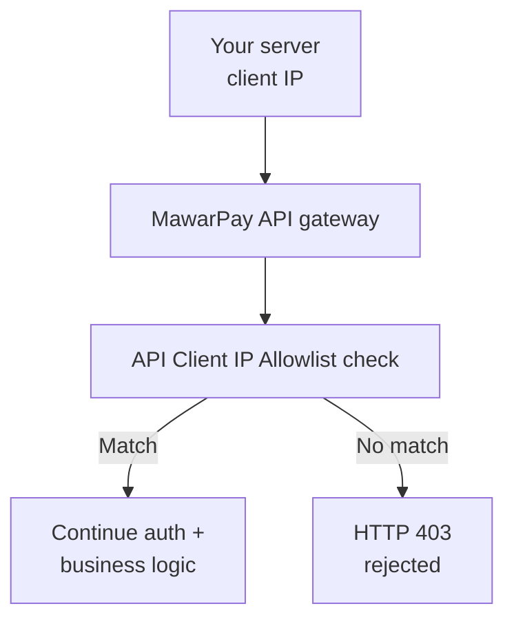

# API Client IP Allowlist

The **API Client IP Allowlist** is a security feature that restricts which source IP addresses can call MawarPay API v1 on behalf of a merchant. Only requests from approved IPs or CIDR ranges are accepted; all others are rejected before endpoint processing.

Create your [API key](/docs/settings/api-keys) first, then open the **IP Whitelist** tab on the same merchant. The portal tab label remains **IP Whitelist**; this page uses **API Client IP Allowlist** to describe the feature.

---

## Overview

Merchants can limit API access to known backend servers. When allowlist entries are configured and active, MawarPay evaluates the client IP on every API request that uses the merchant's `X-API-KEY`.

| Concept | Description |
|---------|-------------|
| Purpose | Restrict API access by merchant source IP |
| Scope | Outbound API calls **from your servers to MawarPay** |
| Configuration | **Merchants → Merchant Detail → IP Whitelist** in the merchant portal |
| Entry types | Single IPv4 addresses and CIDR ranges |
| Enforcement | Non-matching client IPs receive `HTTP 403 Forbidden` |

### API Client IP Allowlist vs webhook delivery

These are separate security mechanisms. Do not confuse API access control with webhook authentication.

| | API Client IP Allowlist | Webhook delivery |
|---|-------------------------|------------------|
| Direction | Your server → MawarPay API | MawarPay → your webhook endpoint |
| What is restricted | Which IPs may **call** the API | Not controlled by the API Client IP Allowlist |
| Portal location | **IP Whitelist** tab on merchant detail | [Webhook Settings](/docs/webhooks-v1) tab |
| Authentication | `X-API-KEY`, Bearer token, and IP allowlist | [Webhook secret](/docs/webhooks-v1#5-security) and `x-signature` header |
| Merchant action | Add your server's outbound IPs | Configure HTTPS URL and verify signatures |

:::warning[No Webhook IP Allowlist in the portal]
MawarPay does **not** provide a merchant-portal **Webhook IP Allowlist** setting. [Webhooks](/docs/webhooks-v1) are authenticated with HMAC signatures, not by matching MawarPay egress IPs in the allowlist. You may optionally restrict inbound traffic on **your** firewall to trusted sources, but that is separate from the API Client IP Allowlist documented here.
:::

---

## Flow

When your application calls MawarPay API v1:




After a successful allowlist match, MawarPay continues with token validation, `X-API-KEY` checks, and the requested endpoint logic.

---

## Configuration

### Prerequisites

1. Sign in at [portal.mawarpay.com](https://portal.mawarpay.com).
2. Create an [API key](/docs/settings/api-keys) for the merchant.
3. Identify the **public outbound IP addresses** of servers that call MawarPay (not your webhook listener).

### Dashboard steps

1. Open the **Merchants** menu.
2. Click a merchant name to open merchant detail.
3. Open the **IP Whitelist** tab.
4. Click **Add IP**.
5. Fill the form (see [Add IP form fields](#add-ip-form-fields)).
6. Click **Add** to save the entry.


### Add IP form fields

| Field | Required | What to enter |
|---|---|---|
| IP address or CIDR | Yes | Single address or CIDR notation. See [Supported IP formats](#supported-ip-formats). |
| Description | No | Optional note (for example `Production app server`). |
| IP range | No | CIDR range when allowing a subnet, for example `10.0.0.0/24`. |
| Type | Yes | Entry kind. Use **Individual** for a single IP. |
| Expires at | No | Optional date and time. Leave empty for no expiry. |
| Active | No | Keep checked so the entry is enforced after you click **Add**. |

Click **Add** to save the entry, or **Cancel** to close the form without changing the list.

---

## Validation process

For each API request associated with a merchant, MawarPay:

1. **Reads the client IP** from the incoming HTTP request.
2. **Loads allowlist entries** from the merchant's **IP Whitelist** tab.
3. **Skips inactive or expired entries** — entries with **Active** disabled or past **Expires at** are not evaluated.
4. **Matches address or CIDR** — the client IP must equal an entry or fall within a configured range.
5. **Allows or rejects** — on match, the request proceeds; otherwise MawarPay returns `HTTP 403 Forbidden` before the endpoint handler runs.

Keep the allowlist aligned with hosts that send API traffic: application servers, batch workers, and failover instances that call MawarPay directly.

---

## Supported IP formats

MawarPay accepts standard IPv4 address and CIDR notation in allowlist entries.

| Format | Example | Description |
|--------|---------|-------------|
| Single IPv4 address | `203.0.113.10` | One host allowed to call the API |
| IPv4 CIDR range | `10.0.0.0/24` | Addresses from `10.0.0.0` through `10.0.0.255` |
| IPv4 CIDR range | `203.0.113.0/24` | Documentation subnet (TEST-NET-3) |

:::note[Use your server's outbound IP]
Allowlist the **public IP address MawarPay sees** when your server makes API requests. Private addresses (for example `192.168.x.x`) apply only when MawarPay receives traffic from that network directly.
:::

Examples use [RFC 5737 documentation addresses](https://datatracker.ietf.org/doc/html/rfc5737). Replace them with your server's outbound IPs before configuring production.

---

## Error response

When the client IP does not match any active allowlist entry, MawarPay returns **`HTTP 403 Forbidden`**. The body follows the standard [error response format](/docs/error-handling-v1#error-response-format).

### Example

```json
{
  "code": 4031327,
  "message": "Access denied. IP address is not on the allowlist."
}
```

| Field | Description |
|-------|-------------|
| HTTP status | `403` — request blocked by access control |
| `code` | Composite response code: `403` (HTTP) + `13` ([`ServiceCodeIPWhitelist`](/docs/response-code-v1#service-codes)) + `27` ([`CaseCodePermissionDenied`](/docs/response-code-v1#authentication-errors-21-30)) |
| `message` | Human-readable explanation of the rejection |

### Troubleshooting `403`

| Check | Action |
|-------|--------|
| Outbound IP | Confirm the IP MawarPay sees matches an allowlist entry. |
| Entry active | Verify the entry is **Active** in the dashboard. |
| Expiry | Confirm **Expires at** has not passed. |
| CIDR coverage | Use a CIDR range if your provider assigns IPs from a subnet. |
| Merchant scope | Ensure the entry is on the merchant that owns the `X-API-KEY`. |

---

## Manage allowlist entries

After you add an IP, the **IP Whitelist** tab shows a success banner and the allowlist table:


| Column | Description |
|---|---|
| IP / CIDR | Address or range you added |
| Description | Note from the form, or `—` if empty |
| Type | Entry kind, for example `individual` |
| Active | `Yes` when the entry is enforced |
| Expires at | Expiry from the form, or `—` if none |
| Created | When the entry was added |
| Actions | **Edit**, toggle active, and **Delete** |

A green banner confirms **IP added to whitelist** after a successful add (portal UI text).

When infrastructure changes (new servers, migration, or IP rotation), update allowlist entries before deploying callers that use new addresses.

---

## Best practices

| Practice | Why |
|----------|-----|
| Allowlist production server IPs only | Reduces exposure if credentials are leaked from an unauthorized host |
| Use CIDR ranges for elastic infrastructure | Covers autoscaled or rolling deployments within the same subnet |
| Set **Expires at** for temporary access | Automatically revokes short-lived integration or migration entries |
| Disable entries instead of deleting when possible | Preserves audit history while stopping enforcement |
| Keep allowlist separate from webhook config | API Client IP Allowlist does not affect [webhook delivery](/docs/webhooks-v1) |
| Verify outbound IP after hosting changes | Prevents `403` errors after cloud migrations or provider IP changes |
| Do not expose allowlist as a substitute for auth | IP allowlist complements `X-API-KEY` and Bearer tokens; use all layers |

---

## Related settings

| Setting | Purpose |
|---------|---------|
| [API Keys](/docs/settings/api-keys) | Authenticate API requests with `X-API-KEY` |
| [Webhooks](/docs/webhooks-v1) | Receive transaction notifications (signature-based, not IP allowlist) |
| [API Client IP Allowlist](/docs/settings/ip-allowlist) | Restrict which client IPs can call the API |

If you have not done so yet, create an [API key](/docs/settings/api-keys) and configure [Webhooks](/docs/webhooks-v1) on the same merchant detail page.
